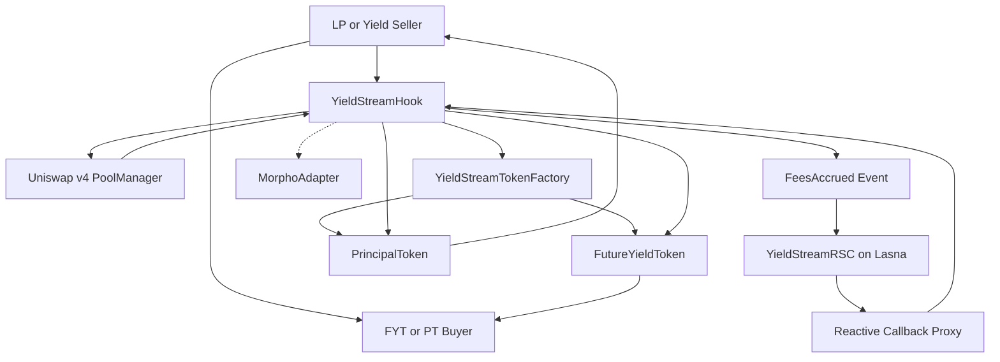
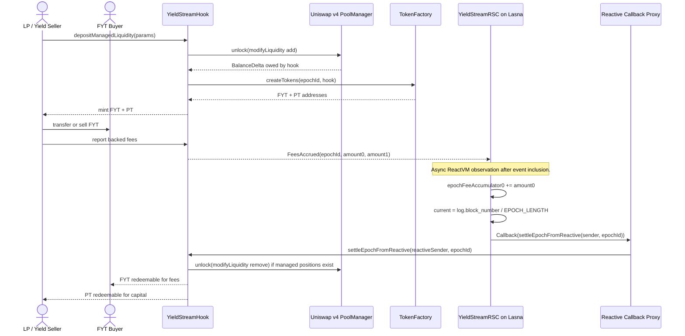
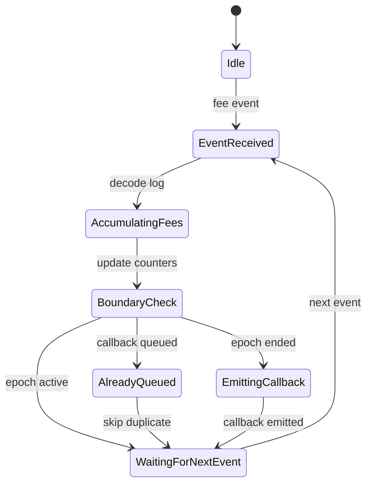

# 🌊 YieldStream Hook

*Tradeable LP yield claims for Uniswap v4, settled autonomously by Reactive Network.*


---

YieldStream Hook is a Uniswap v4 hook that splits a hook-managed LP position into two transferable ERC-20 claims: **FYT**, the Future Yield Token for an epoch's fee stream, and **PT**, the Principal Token for the epoch's LP capital. The hook gives LPs a way to sell future fee income upfront while keeping principal exposure, and gives buyers direct exposure to Uniswap fee generation without managing an LP position. Reactive Network settles epochs by observing `FeesAccrued` events on the destination chain and submitting settlement callbacks through Lasna without a keeper. Built for the UHI9 Hookathon — Impermanent Loss & Yield Systems.

> ⚛️ **Reactive Network Integration**
> YieldStream Hook is powered by Reactive Smart Contracts (RSCs) deployed on Reactive Network. RSCs autonomously monitor on-chain events from Uniswap v4 and trigger callbacks without keepers, bots, or manual intervention. In YieldStream, the RSC watches backed fee-accrual events, detects when the event's epoch is past its block boundary, and queues `settleEpochFromReactive(address,uint256)` back to the hook.

## Table of Contents

- [The Problem](#the-problem)
- [The Solution](#the-solution)
- [Architecture](#architecture)
- [Core Components](#core-components)
- [Reactive Network Integration](#reactive-network-integration)
- [Demo Run](#demo-run)
- [Test Coverage](#test-coverage)
- [Local Development](#local-development)
- [Contributing & License](#contributing--license)
- [Acknowledgements](#acknowledgements)

## The Problem

Uniswap LPs earn fee revenue that is valuable but difficult to use before it is realized. A position can produce meaningful fees over a week or month, but the LP cannot sell that future fee stream separately from the underlying capital, cannot price it cleanly, and cannot transfer only the yield exposure to another market participant. At the same time, the LP still carries impermanent-loss risk on principal.

Previous hookathon work explored adjacent problems. FlexFee-style dynamic fees improve fee selection, Gainswap-style hooks and hedging hooks focus on trading or downside exposure, xtreamly and related streaming concepts improve payment or flow mechanics, Idle Liquidity Yield Hook routes unused capital to yield, and YieldSync-style systems reason about yield routing. Those designs do not make a Uniswap v4 LP position's **future swap-fee income** a separate, epoch-scoped, transferable claim.

The missing primitive is a native AMM yield split: one token for future fees, one token for principal, and an autonomous settlement path that does not rely on a multisig, cron job, or off-chain keeper to close epochs.

**YieldStream Hook solves this by custodying demo LP positions, minting epoch-scoped FYT/PT claims, and using Reactive Network to settle each epoch when subscribed fee events cross the block boundary.**

## The Solution

YieldStream turns a single LP deposit into two assets with different risk profiles. FYT holders receive the epoch's fee distribution after settlement. PT holders receive the settled capital claim after the epoch ends, including the LP capital outcome and any impermanent-loss exposure.

The live demo uses short `20` block epochs so judges can observe Reactive settlement in one session. The production default remains `50,400` blocks, roughly one week at 12 seconds per block.

1. An LP deposits through `depositManagedLiquidity(...)`, and the hook owns/tracks the resulting v4 liquidity position.
2. The hook creates or reuses the active epoch's FYT and PT token contracts through `YieldStreamTokenFactory`.
3. The LP receives FYT weighted by liquidity-blocks and PT equal to principal-liquidity units.
4. The LP can hold both tokens, sell FYT to monetize future fees, or transfer PT to sell principal exposure.
5. The fee reporter transfers real token backing into the hook and emits `FeesAccrued(epochId, amount0, amount1)`.
6. `YieldStreamRSC` observes the event on Reactive Network and queues settlement when the event's epoch has passed its block boundary.
7. FYT holders redeem fee proceeds and PT holders redeem capital after `EpochSettled`.

> ⚖️ **Risk Accounting:** FYT buyers absorb fee-variance risk; PT holders absorb LP principal and impermanent-loss risk; Reactive Network only automates settlement and does not underwrite either side.

## Architecture

### System Overview Diagram



### User Journey Diagram



### RSC State Transition Diagram



### Hook Callback Logic

| Callback | Used | Behavior |
|----------|------|----------|
| `beforeSwap` | ❌ | Not used; YieldStream does not alter swap execution before pricing. |
| `afterSwap` | ✅ | Validates the configured pool and ensures the active epoch token contracts exist; fee accounting is handled by backed `reportFees(...)` in the demo build. |
| `afterAddLiquidity` | ✅ | Requires hook-managed liquidity metadata, records the position, accounts liquidity-block weight, and mints FYT/PT. |
| `beforeRemoveLiquidity` | ✅ | Enforces epoch lockup for tracked hook-managed positions and rejects caller-supplied epoch bypasses. |

## Core Components

### YieldStreamHook.sol

Main Uniswap v4 hook that owns demo-managed liquidity, mints epoch tokens, accounts for backed fees, validates Reactive callbacks, settles epochs, and routes redemptions.

| Function | Visibility | Description |
|----------|------------|-------------|
| `depositManagedLiquidity(ManagedLiquidityParams)` | `external` | Pulls max token amounts, adds hook-owned liquidity through PoolManager unlock, refunds unused token amounts, and mints FYT/PT. |
| `unlockCallback(bytes)` | `external` | PoolManager unlock callback for adding or removing hook-owned liquidity. |
| `reportFees(PoolKey,uint256,uint256,uint256)` | `external` | Restricted fee-reporting path that transfers real token backing and emits `FeesAccrued`. |
| `settleEpoch(uint256)` | `external` | Direct settlement path restricted to `directSettlementCaller`. |
| `settleEpochFromReactive(address,uint256)` | `external` | Reactive callback entrypoint restricted by callback proxy and injected/encoded RVM sender. |
| `triggerSettlement(uint256)` | `external` | Permissionless fallback settlement after epoch end. |
| `redeemFYT(uint256,uint256)` | `external` | Burns FYT and pays the caller's pro-rata settled fees. |
| `redeemPT(uint256,uint256)` | `external` | Burns PT and pays the caller's pro-rata settled capital. |
| `getHookPermissions()` | `public` | Returns the Uniswap v4 callback permission set. |

| Variable | Type | Description |
|----------|------|-------------|
| `_epochs` | `mapping(uint256 => EpochState)` | Internal epoch accounting, token addresses, currencies, and settlement flags. |
| `positions` | `mapping(bytes32 => PositionInfo)` | Hook-managed position metadata keyed by pool, owner, ticks, salt, and epoch. |
| `fytContracts` | `mapping(uint256 => address)` | Epoch to FYT token address. |
| `ptContracts` | `mapping(uint256 => address)` | Epoch to PT token address. |
| `epochFees0` / `epochFees1` | `mapping(uint256 => uint256)` | Public fee totals by epoch. |
| `callbackProxy` | `address` | Destination callback proxy authorized to call `settleEpochFromReactive`. |
| `reactiveSender` | `address` | Expected RVM/deployer identity passed as the first callback argument. |
| `feeReporter` | `address` | Account authorized to report backed demo fees. |
| `epochLength` | `uint256 immutable` | Configurable epoch length; defaults to `50,400` blocks. |

Hook permissions:

- ✅ `afterAddLiquidity`
- ✅ `beforeRemoveLiquidity`
- ✅ `afterSwap`
- ❌ `beforeInitialize`
- ❌ `afterInitialize`
- ❌ `beforeAddLiquidity`
- ❌ `afterRemoveLiquidity`
- ❌ `beforeSwap`
- ❌ `beforeDonate`
- ❌ `afterDonate`
- ❌ `beforeSwapReturnDelta`
- ❌ `afterSwapReturnDelta`
- ❌ `afterAddLiquidityReturnDelta`
- ❌ `afterRemoveLiquidityReturnDelta`

### YieldStreamRSC.sol

Reactive Smart Contract deployed on Lasna that subscribes to hook `FeesAccrued` logs and queues settlement callbacks when an event belongs to an epoch that has ended.

| Item | Detail |
|------|--------|
| Subscription event | `FeesAccrued(uint256,uint256,uint256)` |
| Source contract | Destination `YieldStreamHook` address on Base Sepolia or Unichain Sepolia |
| Source chains | Base Sepolia `84532`, Unichain Sepolia `1301` |
| ReactVM state | `initialized`, `lastObservedEpoch`, `settlementQueued`, `epochFeeAccumulator0` |
| Callback | `settleEpochFromReactive(address,uint256)` |
| Destination | Same chain as the hook that emitted `FeesAccrued` |

`react()` decodes `IReactive.LogRecord`, accumulates the indexed `amount0`, compares `log.block_number / EPOCH_LENGTH` with the event epoch, and emits a Reactive `Callback` only once per event epoch.

### FutureYieldToken.sol

ERC-20 claim token representing the right to redeem a settled epoch's fees.

| Function | Visibility | Description |
|----------|------------|-------------|
| `mint(address,uint256)` | `external` | Mints FYT; callable only by the hook. |
| `burn(address,uint256)` | `external` | Burns FYT; callable only by the hook. |
| `settle(uint256,uint256)` | `external` | Stores fee-per-token values once settlement occurs. |
| `redeem(address)` | `external` | Calls back into the hook to redeem the caller's full FYT balance. |

| Variable | Type | Description |
|----------|------|-------------|
| `epochId` | `uint256 immutable` | Epoch represented by this token. |
| `hook` | `address immutable` | Only authorized minter, burner, and settler. |
| `settled` | `bool` | True once fee-per-token values are fixed. |
| `feesPerToken0` / `feesPerToken1` | `uint256` | Settled fee distribution rates. |

### PrincipalToken.sol

ERC-20 claim token representing the right to redeem settled LP principal.

| Function | Visibility | Description |
|----------|------------|-------------|
| `mint(address,uint256)` | `external` | Mints PT; callable only by the hook. |
| `burn(address,uint256)` | `external` | Burns PT; callable only by the hook. |
| `enableRedemption(uint256,uint256)` | `external` | Stores capital-per-token values and unlocks redemption. |
| `redeem(address)` | `external` | Calls back into the hook to redeem the caller's full PT balance. |

| Variable | Type | Description |
|----------|------|-------------|
| `epochId` | `uint256 immutable` | Epoch represented by this token. |
| `hook` | `address immutable` | Only authorized minter, burner, and redemption enabler. |
| `redeemable` | `bool` | True once principal redemption is enabled. |
| `capitalPerToken0` / `capitalPerToken1` | `uint256` | Settled capital distribution rates. |

### YieldStreamTokenFactory.sol

Factory contract that deploys FYT and PT pairs for an epoch, keeping the main hook below the EIP-170 runtime-size limit.

| Function | Visibility | Description |
|----------|------------|-------------|
| `createTokens(uint256,address)` | `external` | Deploys a new `FutureYieldToken` and `PrincipalToken` pair for an epoch. |

| Variable | Type | Description |
|----------|------|-------------|
| None | `N/A` | Stateless deployment helper. |

### MorphoAdapter.sol

Adapter shell for routing idle capital into Morpho Blue; deployed and independently tested, but not active in the live hook settlement path.

| Function | Visibility | Description |
|----------|------------|-------------|
| `setHook(address)` | `external` | One-time hook binding. |
| `deposit(address,uint256,MarketParams)` | `external` | Hook-only deposit path; calls Morpho if a Morpho contract exists. |
| `withdraw(address,uint256,MarketParams)` | `external` | Hook-only withdrawal path; calls Morpho if a Morpho contract exists. |
| `setMockYield(uint256,address,uint256)` | `external` | Hook-only deterministic test/demo yield setter. |
| `pendingYield(uint256,address)` | `external view` | Reads mocked pending yield. |

| Variable | Type | Description |
|----------|------|-------------|
| `morpho` | `address immutable` | Morpho Blue address supplied at deploy time. |
| `hook` | `address` | Bound hook address authorized to use adapter functions. |
| `depositedAssets` | `mapping(uint256 => mapping(address => uint256))` | Deterministic deposit accounting by block and token. |
| `mockYield` | `mapping(uint256 => mapping(address => uint256))` | Test/demo pending-yield map. |

## Reactive Network Integration

### Why Reactive Network?

YieldStream settlement is event-driven rather than time-scheduled. Reactive Network is the right fit because the RSC can subscribe directly to hook logs, keep per-epoch state on ReactVM, and submit a callback only after a real on-chain event proves that an epoch boundary has been crossed. A conventional keeper can perform similar polling, but it adds an off-chain operator; the RSC keeps the demo's settlement story inside an auditable Reactive execution path.

### RSC Event Subscription

```solidity
// Event emitted by YieldStreamHook
event FeesAccrued(
    uint256 indexed epochId,
    uint256 indexed amount0,
    uint256 amount1
);

// Topic used by YieldStreamRSC
uint256 public constant FEES_ACCRUED_TOPIC =
    uint256(keccak256("FeesAccrued(uint256,uint256,uint256)"));
```

The RSC subscribes with the legacy Reactive library:

```solidity
service.subscribe(
    DESTINATION_CHAIN_ID,
    HOOK_ADDRESS,
    FEES_ACCRUED_TOPIC,
    REACTIVE_IGNORE,
    REACTIVE_IGNORE,
    REACTIVE_IGNORE
);
```

### ReactVM Computation

`YieldStreamRSC` maintains `epochFeeAccumulator0`, `lastObservedEpoch`, and `settlementQueued`. On each log, it records the event epoch, adds indexed `amount0` to the accumulator, computes the current epoch from `log.block_number / EPOCH_LENGTH`, and queues one callback for that event epoch if the current block is past the epoch boundary.

```solidity
function react(LogRecord calldata log) external vmOnly {
    uint256 eventEpoch = log.topic_1;
    uint256 fee0 = log.topic_2;
    uint256 current = log.block_number / EPOCH_LENGTH;

    epochFeeAccumulator0[eventEpoch] += fee0;
    initialized = true;
    lastObservedEpoch = eventEpoch;

    if (current > eventEpoch && !settlementQueued[eventEpoch]) {
        settlementQueued[eventEpoch] = true;
        bytes memory payload = abi.encodeWithSignature(
            "settleEpochFromReactive(address,uint256)",
            CALLBACK_SENDER,
            eventEpoch
        );
        emit Callback(DESTINATION_CHAIN_ID, HOOK_ADDRESS, CALLBACK_GAS_LIMIT, payload);
    }
}
```

### Callback Flow

```text
[Base Sepolia or Unichain Sepolia] YieldStreamHook emits FeesAccrued
    -> YieldStreamRSC detects the event on Reactive Network
    -> react() executes on ReactVM
    -> RSC emits Callback(destinationChainId, hookAddress, gasLimit, calldata)
    -> Reactive Network relayer submits the destination transaction
    -> YieldStreamHook.settleEpochFromReactive(sender, epochId) executes
```

### Access Control

The destination hook restricts Reactive settlement with two checks: the caller must be the configured Reactive callback proxy, and the first callback argument must match the configured RVM/deployer identity.

```solidity
function settleEpochFromReactive(address sender, uint256 epochId) external {
    if (msg.sender != callbackProxy || sender != reactiveSender) revert OnlyRSC();
    _settleEpoch(epochId);
}
```

`settleEpoch(uint256)` remains restricted to `directSettlementCaller`, while `triggerSettlement(uint256)` is a permissionless fallback that can settle after epoch end if the RSC path is unavailable.

## Demo Run

The testnet demo validates the full lifecycle: deployed hook addresses, Lasna subscription proof, LP deposit, FYT/PT minting, backed fee events, ReactVM observation, Reactive callback queuing, destination settlement, and redeemable token state. The live demo uses `20` block epochs so the callback can land during a judge session.

### Deployed Contracts

| Contract | Address | Explorer |
|----------|---------|----------|
| Unichain Sepolia `YieldStreamHook` | `0x4C7734FfB1C9F054E1b16f1BBdcD9aEa98E80640` | [View on Explorer](https://unichain-sepolia.blockscout.com/address/0x4C7734FfB1C9F054E1b16f1BBdcD9aEa98E80640) |
| Unichain Sepolia `YieldStreamTokenFactory` | `0x97bf008af093831Aa3CCde2565c2de89d52643a5` | [View on Explorer](https://unichain-sepolia.blockscout.com/address/0x97bf008af093831Aa3CCde2565c2de89d52643a5) |
| Unichain Sepolia `MorphoAdapter` | `0xf15CE9D5855CDFFeF4a9F9AbdC013Dc07cb3F0cD` | [View on Explorer](https://unichain-sepolia.blockscout.com/address/0xf15CE9D5855CDFFeF4a9F9AbdC013Dc07cb3F0cD) |
| Lasna `YieldStreamRSC` for Unichain | `0xf9C557b4097f399dBa99EB1DB2caf5fc7ADfE786` | [View on Explorer](https://lasna.reactscan.net/address/0xf9C557b4097f399dBa99EB1DB2caf5fc7ADfE786) |
| Base Sepolia `YieldStreamHook` | `0x4DeEB34Db482d776e043539394Fa70b772890640` | [View on Explorer](https://base-sepolia.blockscout.com/address/0x4DeEB34Db482d776e043539394Fa70b772890640) |
| Lasna `YieldStreamRSC` for Base | `0xD4342b1B631a5a465E09b81d1b99E6438c61d453` | [View on Explorer](https://lasna.reactscan.net/address/0xD4342b1B631a5a465E09b81d1b99E6438c61d453) |

### End-to-End Demo Steps

### Step 1 — Deploy Core Contracts

**Action:** Deploy the token factory, Morpho adapter, mined hook address, and Lasna RSC.
**Expected:** All contracts deploy, the adapter binds to the hook, and the RSC subscription is configured.
**Result:** ✅ Deployed and read back on Base Sepolia, Unichain Sepolia, and Lasna.
**Transaction:** [`0x496b...6261`](https://unichain-sepolia.blockscout.com/tx/0x496b53ae7862ccb67bfceed2303f930a0cddf1b79b0dd13141c0f9b8f8316261)

### Step 2 — Configure Lasna Subscription

**Action:** Configure the legacy Reactive subscription for `FeesAccrued(uint256,uint256,uint256)`.
**Expected:** The RSC records `subscriptionConfigured() == true`.
**Result:** ✅ Subscription configured on Lasna for the Unichain deployment.
**Transaction:** [`0x4346...416b`](https://lasna.reactscan.net/tx/0x434685da655bcbdc5b2e8b19a545f9fb37726bbeb2201cb5cb4e85a63b3a416b)

### Step 3 — Deposit Hook-Managed Liquidity

**Action:** The LP deposits through `depositManagedLiquidity(...)`.
**Expected:** The hook owns/tracks the v4 liquidity and mints FYT/PT for the active epoch.
**Result:** ✅ Unichain epoch `2691520` minted FYT `0x380D359015Df909ee939918513c307EEF12DE183` and PT `0xD3E5afC202Ed9469d01d79278Ce910A58E11d16D`.
**Transaction:** [`0xa224...e886`](https://unichain-sepolia.blockscout.com/tx/0xa2247bdb86acbd764d504033a8783fe7877a28cb857749d07a584d126f46e886)

### Step 4 — Emit First Backed Fee Event

**Action:** The fee reporter transfers backing into the hook and emits `FeesAccrued`.
**Expected:** Reactive Network observes the event but does not settle until the epoch boundary condition is true.
**Result:** ✅ Destination event emitted and Lasna observation transaction found.
**Transaction:** [`0x2068...a55f`](https://unichain-sepolia.blockscout.com/tx/0x20686899687ae1014513aed573c4ae92e21fa39e57e906145642eafcf1a9a55f)

### Step 5 — Observe on Lasna

**Action:** ReactVM receives the subscribed log and records the observed epoch.
**Expected:** RSC updates ReactVM state and waits if the event is still inside the epoch.
**Result:** ✅ Lasna observation transaction recorded.
**Transaction:** [`0xd534...4387`](https://lasna.reactscan.net/tx/0xd53475e95c4658874a0eafa7159bc6175c66ac2dff6ed9d4c160d9d0395f4387)

### Step 6 — Emit Boundary Fee Event

**Action:** After the short demo epoch boundary, emit a post-boundary `FeesAccrued` event for the original epoch.
**Expected:** RSC computes `currentEpoch > eventEpoch` and queues settlement.
**Result:** ✅ Boundary event emitted on Unichain Sepolia.
**Transaction:** [`0x792e...46b4`](https://unichain-sepolia.blockscout.com/tx/0x792e873841ffacc1d4ad99a1ff25c528ec2ca5a87f430c41afc1620aa23546b4)

### Step 7 — Queue Reactive Callback on Lasna

**Action:** RSC emits a Reactive `Callback` to the destination hook.
**Expected:** Lasna records `SettlementCallbackQueued(epochId, hook)`.
**Result:** ✅ Callback queued on Lasna.
**Transaction:** [`0x87c7...ea79`](https://lasna.reactscan.net/tx/0x87c79b9f2dac613a8ceff9ec5d2a48fce55bb71ca4c90eef0fe23abe6d5eea79)

### Step 8 — Settle on Destination Chain

**Action:** Reactive Network relayer submits the callback to `settleEpochFromReactive`.
**Expected:** The hook emits `EpochSettled`, FYT becomes settled, and PT becomes redeemable.
**Result:** ✅ Destination callback landed and `EpochSettled` emitted.
**Transaction:** [`0x6b8a...3fbc`](https://unichain-sepolia.blockscout.com/tx/0x6b8a3f668ae2c0d8e6f5d106443f829933c3c7314671fd7182d9b29686623fbc)

### Demo Output

```bash
$ YIELDSTREAM_E2E_NETWORK=unichain bash script/testnet-demo-with-txids.sh

Destination chain: unichain-sepolia (1301)
Hook: 0x4C7734FfB1C9F054E1b16f1BBdcD9aEa98E80640
Lasna RSC: 0xf9C557b4097f399dBa99EB1DB2caf5fc7ADfE786
Epoch length: 20 blocks

Hook-managed liquidity deposit -> 0xa2247bdb86acbd764d504033a8783fe7877a28cb857749d07a584d126f46e886
Explorer -> https://unichain-sepolia.blockscout.com/tx/0xa2247bdb86acbd764d504033a8783fe7877a28cb857749d07a584d126f46e886

FeesAccrued event 1 -> 0x20686899687ae1014513aed573c4ae92e21fa39e57e906145642eafcf1a9a55f
Explorer -> https://unichain-sepolia.blockscout.com/tx/0x20686899687ae1014513aed573c4ae92e21fa39e57e906145642eafcf1a9a55f

Lasna RVM observed event 1 -> 0xd53475e95c4658874a0eafa7159bc6175c66ac2dff6ed9d4c160d9d0395f4387
Explorer -> https://lasna.reactscan.net/tx/0xd53475e95c4658874a0eafa7159bc6175c66ac2dff6ed9d4c160d9d0395f4387

FeesAccrued boundary event -> 0x792e873841ffacc1d4ad99a1ff25c528ec2ca5a87f430c41afc1620aa23546b4
Explorer -> https://unichain-sepolia.blockscout.com/tx/0x792e873841ffacc1d4ad99a1ff25c528ec2ca5a87f430c41afc1620aa23546b4

Lasna RVM queued callback -> 0x87c79b9f2dac613a8ceff9ec5d2a48fce55bb71ca4c90eef0fe23abe6d5eea79
Explorer -> https://lasna.reactscan.net/tx/0x87c79b9f2dac613a8ceff9ec5d2a48fce55bb71ca4c90eef0fe23abe6d5eea79

Reactive destination callback / EpochSettled -> 0x6b8a3f668ae2c0d8e6f5d106443f829933c3c7314671fd7182d9b29686623fbc
Explorer -> https://unichain-sepolia.blockscout.com/tx/0x6b8a3f668ae2c0d8e6f5d106443f829933c3c7314671fd7182d9b29686623fbc

Epoch: 2691520
FYT: 0x380D359015Df909ee939918513c307EEF12DE183
PT: 0xD3E5afC202Ed9469d01d79278Ce910A58E11d16D
FYT settled: true
PT redeemable: true
```

Base Sepolia mirror proof is also live:

```bash
Hook-managed liquidity deposit -> https://base-sepolia.blockscout.com/tx/0x69c8fb75c48bdf08488bf5d87d0b81df9989586652de92e3c8c592e99ef02fbd
FeesAccrued event 1 -> https://base-sepolia.blockscout.com/tx/0x2fdd7fb41fd787f6b2a97612a0e64d37929ca1189c7464004a515a672298316a
Lasna RVM observed event 1 -> https://lasna.reactscan.net/tx/0xea60015f0c65c364f88a9075b32b728b6b632a2e18334617f8af03a185a6c637
FeesAccrued boundary event -> https://base-sepolia.blockscout.com/tx/0xaf0f052341722586a4114b40ab034e596db948916a2139bb0321eff432cd6b51
Lasna RVM queued callback -> https://lasna.reactscan.net/tx/0x87a7ace4028833c752a319d79f3676fd360d54fae436a013f04a8f55b0f9ff52
Reactive destination callback / EpochSettled -> https://base-sepolia.blockscout.com/tx/0x0444c396d5b1f47b49bc8cd350affb6fecb38de199fa587ed97b8b121bae5541
```

## Test Coverage

This project maintains 100% protocol-owned function coverage, verified with `forge coverage`; line and branch coverage are reported honestly below.

### Coverage Report

```text
Ran 5 test suites in 103.31ms (122.23ms CPU time): 52 tests passed, 0 failed, 0 skipped (52 total tests)

╭----------------------------------------+------------------+------------------+----------------+-----------------╮
| File                                   | % Lines          | % Statements     | % Branches     | % Funcs         |
+=================================================================================================================+
| src/YieldStreamHook.sol                | 98.04% (351/358) | 93.97% (421/448) | 64.29% (45/70) | 100.00% (53/53) |
|----------------------------------------+------------------+------------------+----------------+-----------------|
| src/adapters/MorphoAdapter.sol         | 96.55% (28/29)   | 96.30% (26/27)   | 100.00% (7/7)  | 100.00% (8/8)   |
|----------------------------------------+------------------+------------------+----------------+-----------------|
| src/rsc/YieldStreamRSC.sol             | 100.00% (36/36)  | 100.00% (33/33)  | 100.00% (6/6)  | 100.00% (5/5)   |
|----------------------------------------+------------------+------------------+----------------+-----------------|
| src/tokens/FutureYieldToken.sol        | 100.00% (16/16)  | 100.00% (12/12)  | 100.00% (2/2)  | 100.00% (6/6)   |
|----------------------------------------+------------------+------------------+----------------+-----------------|
| src/tokens/PrincipalToken.sol          | 100.00% (16/16)  | 100.00% (12/12)  | 100.00% (2/2)  | 100.00% (6/6)   |
|----------------------------------------+------------------+------------------+----------------+-----------------|
| src/tokens/YieldStreamTokenFactory.sol | 100.00% (3/3)    | 100.00% (2/2)    | 100.00% (0/0)  | 100.00% (1/1)   |
|----------------------------------------+------------------+------------------+----------------+-----------------|
| Total                                  | 98.25% (450/458) | 94.76% (506/534) | 71.26% (62/87) | 100.00% (79/79) |
╰----------------------------------------+------------------+------------------+----------------+-----------------╯
```

### Coverage Screenshot


Add an exported screenshot of the forge coverage terminal output as `assets/coverage.png` before the final public submission package. The numeric report above is the committed source of truth for this README.

### Test Suite Summary

| Test File | Tests | Coverage Focus |
|-----------|-------|----------------|
| `test/YieldStreamHook.t.sol` | 40 | Hook permissions, custody, settlement, Reactive callbacks, guards, redemptions |
| `test/MorphoAdapter.t.sol` | 7 | Morpho adapter success paths and token failure guards |
| `test/YieldStreamIntegration.t.sol` | 1 | Full Alice/Bob lifecycle |
| `test/YieldStreamFuzz.t.sol` | 3 | Fee distribution, PT redemption, early-vs-late FYT weighting |
| `test/YieldStreamFork.t.sol` | 1 | RPC-gated fork harness |

Total: `52` tests passing · `98.25%` line · `71.26%` branch · `100.00%` function coverage under the protocol-filtered command.

```bash
forge test --match-path "test/**" -vvv
```

```bash
forge coverage --ir-minimum --exclude-tests --no-match-coverage 'script|src/demo|src/rsc/ReactivePing|test' --report lcov
```

## Local Development

### Prerequisites

```bash
# Required
forge --version    # Foundry
node --version     # Node.js for frontend and helper scripts
```

### Installation

```bash
git clone --recursive https://github.com/Najnomics/yieldstream-hook.git
cd yieldstream-hook
forge install
```

### Environment Setup

```bash
cp .env.example .env
# Fill in:
# PRIVATE_KEY=
# REACTIVE_PRIVATE_KEY=
# BASE_SEPOLIA_RPC_URL=
# UNICHAIN_SEPOLIA_RPC_URL=
# LASNA_RPC_URL=https://lasna-rpc.rnk.dev/
# POOL_MANAGER=
# CALLBACK_PROXY=
# HOOK_ADDRESS=
```

### Run Tests

```bash
forge test -vvv
```

### Deploy

```bash
# Deploy hook
forge script script/Deploy.s.sol:DeployYieldStream --rpc-url $UNICHAIN_SEPOLIA_RPC_URL --broadcast

# Deploy RSC on Lasna
forge script script/DeployReactive.s.sol:DeployYieldStreamReactive --rpc-url $LASNA_RPC_URL --broadcast
```

### Run Demo

```bash
# Local dry-run
forge script script/DemoYieldStream.s.sol -vvv

# Live testnet proof with txids
YIELDSTREAM_E2E_NETWORK=unichain bash script/testnet-demo-with-txids.sh
YIELDSTREAM_E2E_NETWORK=base bash script/testnet-demo-with-txids.sh
```

## Contributing & License

Contributions should follow the standard fork, branch, and pull-request flow:

1. Fork the repository.
2. Create a focused branch for the change.
3. Run `forge test -vvv` before opening a PR.
4. Include coverage impact for contract changes.
5. Open a PR with a clear description of the behavior changed.

YieldStream Hook is released under the MIT License. See [LICENSE](LICENSE).

## Acknowledgements

- Uniswap Hook Incubator UHI9 and Atrium Academy for the Impermanent Loss & Yield Systems track.
- Reactive Network team for Lasna testnet support, the legacy endpoint guidance, and `Reactive-Network/reactive-lib`.
- Uniswap v4 and `v4-hooks-public` for the hook base contracts and hook-mining utilities.
- Morpho for the Blue market interface used by the adapter shell.
- Prior hookathon work including FlexFee, Gainswap, xtreamly, Idle Liquidity Yield Hook, and YieldSync for clarifying the design space around dynamic fees, yield routing, and LP risk.
